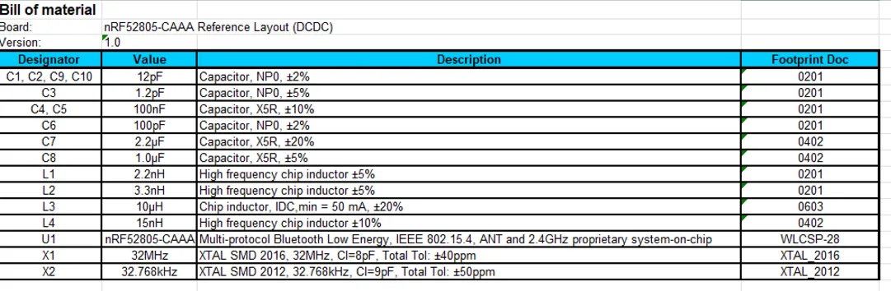
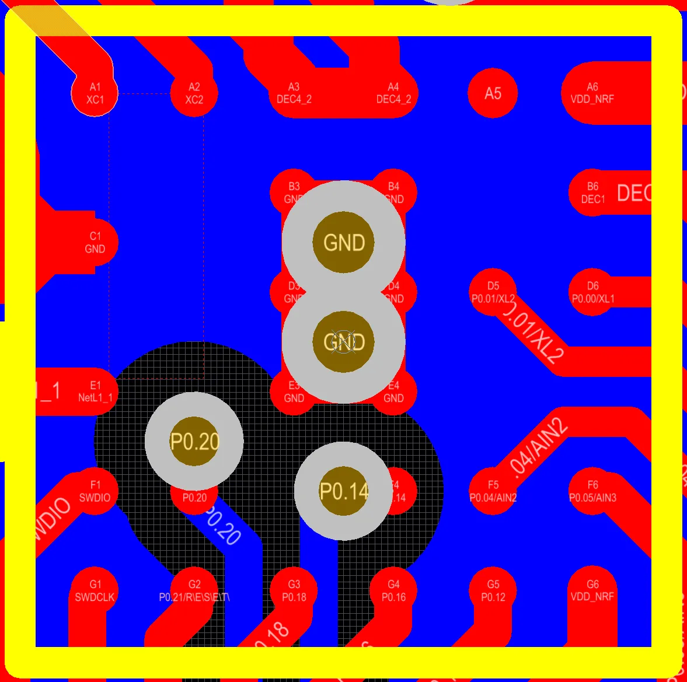
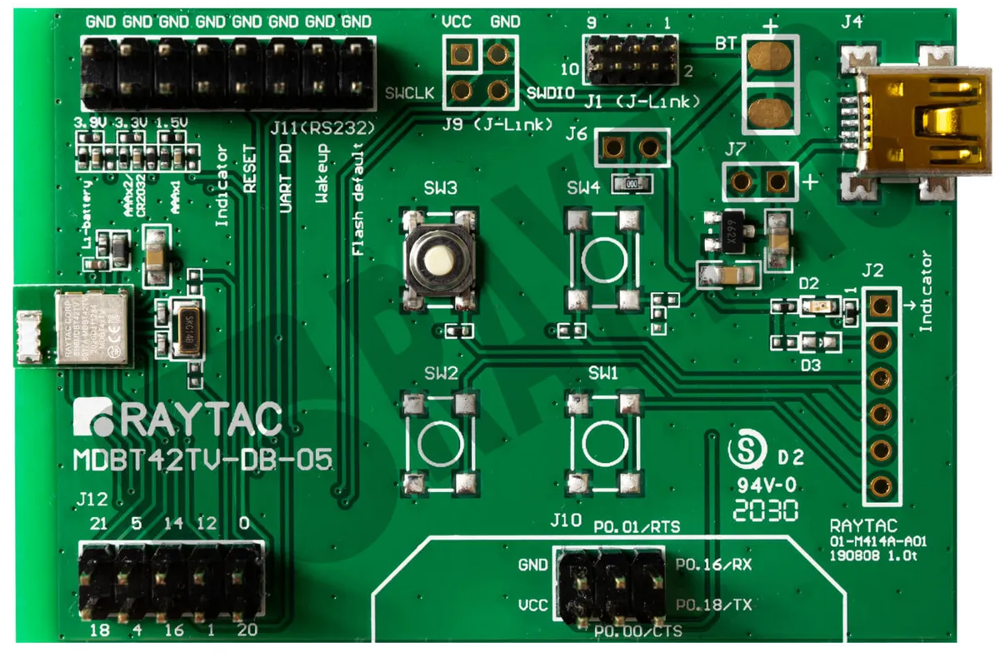
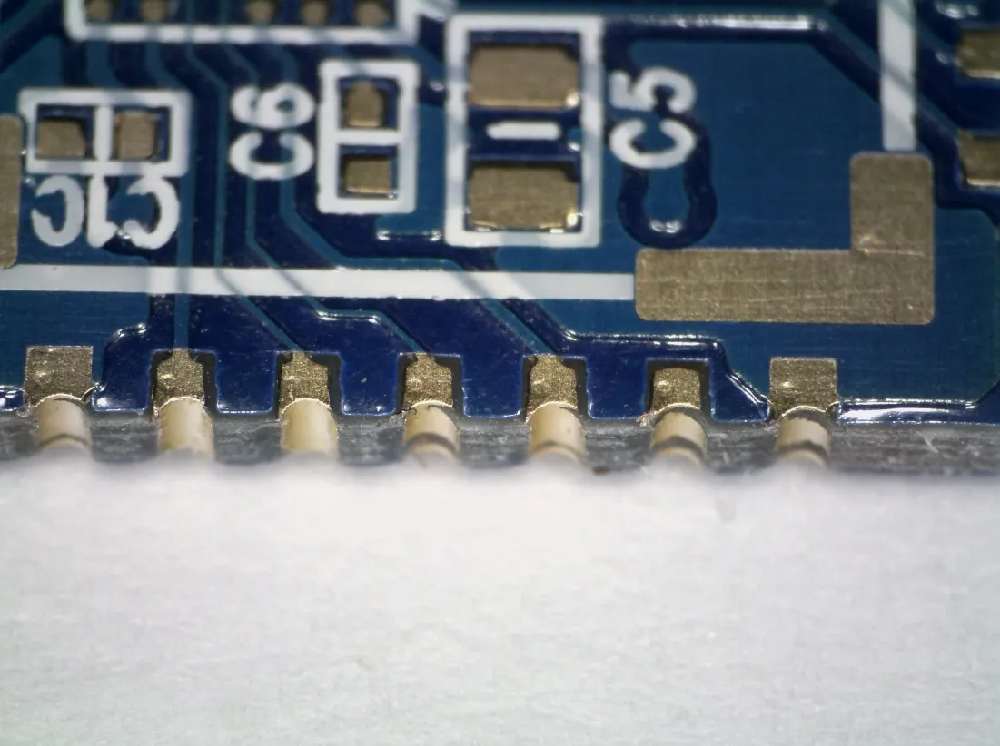
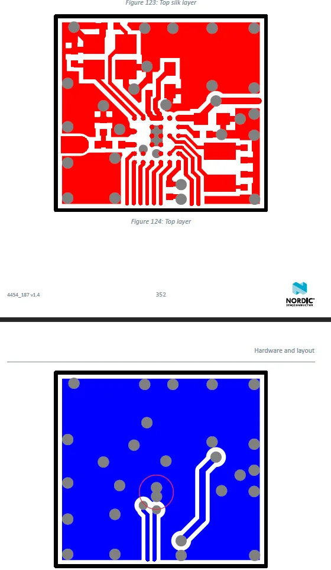
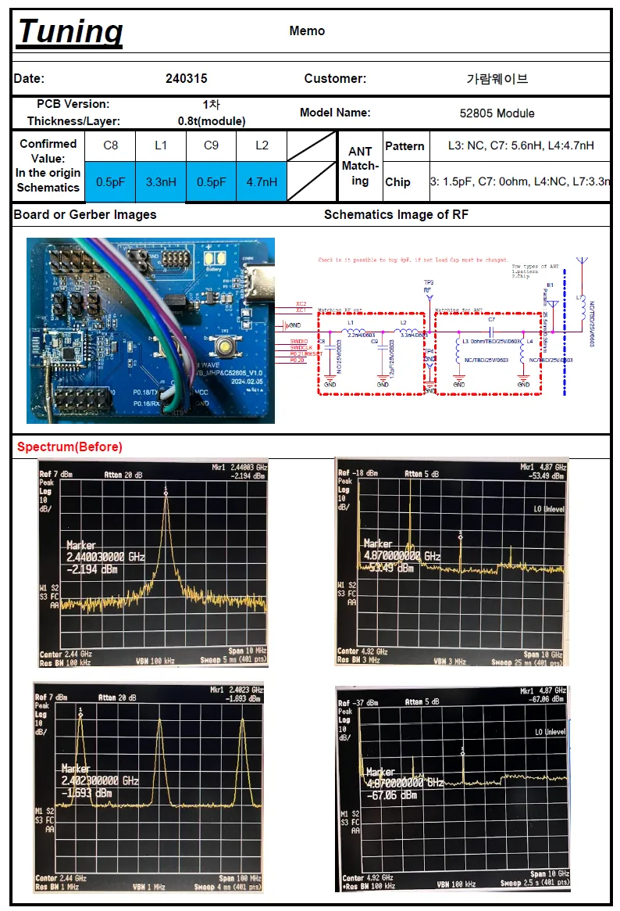
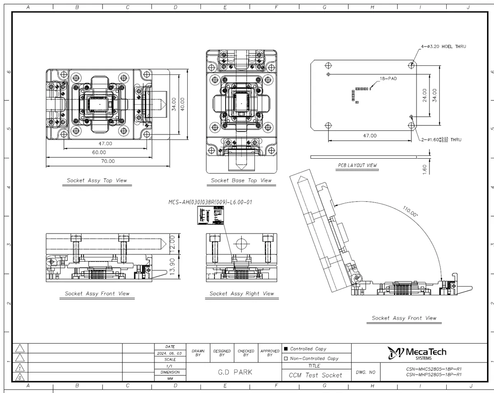
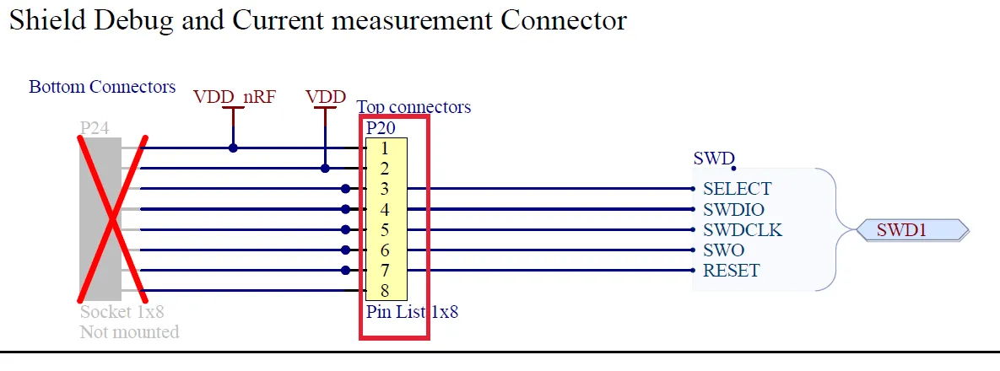

# The Ultimate Engineering Guide: Developing Ultra-Small nRF52805 BLE Modules from Design to Mass Production

Developing ultra-compact wireless modules is not just about connecting circuits; it is about a profound understanding of physical constraints and manufacturing process characteristics. This post provides an in-depth engineering analysis of the entire development lifecycle of an nRF52805-based module.

---

## 1. Initial Strategy: Optimizing Chipset and PCB Layering

- **Chipset Selection**: Adopted the nRF52805 WL-CSP package to achieve an ultra-small form factor.
- **Layering Strategy**: Started with a **2-layer design** due to the low pin count, but maintained a **4-layer fallback strategy** to ensure adequate GND planes and component density.
- **Miniaturization**: Implemented **0603 (0201 inch)** sized passive components throughout the design to minimize the overall module area.

*Figure 1: Review of Nordic reference BOM and implementation of 0603 (0201 inch) miniature components.*

*Figure 2: Initial Shield CAN mechanical clearance and interference study.*

---

## 2. H/W Design Differentiation: Advanced Techniques for Reliability

To ensure long-term reliability beyond basic functionality, we implemented the following advanced design techniques:

- **HPL (Hole Plugged and Lacquered) Technology**: 
    - Applied HPL to all vias to block gas emission during the soldering of the RF IC and peripheral components. This prevents "Cold Solder" joints and ensures consistent RF performance.
- **X-tal Noise Isolation**: 
    - Isolated the copper around the 32MHz crystal to minimize the impact of surrounding high-frequency noise on clock stability.
- **RF Path Optimization**: 
    - Implemented a diagonal straight-line pattern from the IC output to the antenna, significantly improving transmission loss compared to traditional curved patterns.

*Figure 3: Via HPL treatment and RF pattern layout for reliability.*

---

## 3. Manufacturing Deep Dive: Half Hole Issues and Solutions

### **Half Hole (Castellated Hole) Design Standards**
To resolve plating delamination issues during the fabrication of side-soldering half holes, we established the following standards after close consultation with the manufacturer:

| Item | Design Specification | Notes |
| :--- | :--- | :--- |
| **Drill** | 0.4mm | Prevents interference with the 1.0mm routing drill |
| **Pad** | 0.6mm (Min.) | Minimum threshold for plating survival during etching |
| **Reinforcement** | Pad on Via | Ensures electrical connectivity even if the side is damaged |

### **Etching and Thickness Control**
- **Etching Process**: Evaluated precision etching methods superior to standard panel plating to enhance the shape retention of the half holes.
- **Thickness Management**: Used 0.8T material but accounted for plating and surface treatments in the design to achieve a final target thickness of approximately 0.9T.

*Figure 4: Analysis of half hole plating loss cases and the resulting design correction.*

---

## 4. 7 Rounds of CAD Review History

The project underwent seven rounds of rigorous CAD reviews to achieve perfection.

| Round | Key Reviews and Revisions |
| :--- | :--- |
| **1-2** | Review of Shield CAN mechanics and non-plate mounting pad placement |
| **3-4** | Minimizing RF section traces and reinforcing Antenna-GND isolation |
| **5** | 90-degree rotation of the Y1 crystal and trace length optimization |
| **6** | Verification of soldering pad alignment between the mainboard (EVB) and the module |
| **7** | Final inspection of Shield CAN solder mask areas and silk-screen text |

*Figure 5: Layout optimization process through iterative CAD reviews.*

---

## 5. Empirical Data-Driven RF Tuning

- **Antenna Matching**: Optimized impedance matching using a Pi (π) matching network (L3, C7, L4).
- **Performance Improvement**: Identified gain degradation caused by the initial wave-shaped antenna being too close to the GND. Improved radiation efficiency by reducing antenna width and increasing GND clearance.

*Figure 6: Antenna characterization and tuning process through chamber measurements.*

---

## 6. Mass Production Inspection JIG and Software Logic

We developed a precision socket JIG and dedicated test logic to ensure quality during mass production.

### **Short/Open Inspection Algorithm**
Implemented an automated software sequence to verify the connection status of all GPIOs:
1. Set all I/Os to Pull-up state.
2. Set a specific I/O to Out-mode (Low output).
3. Read the remaining I/Os in Input-mode to check for any Low inputs (Detecting I/O-to-I/O shorts).
4. Repeat sequentially for all pins.

### **RF Quality Inspection (DTM)**
- **Direct Test Mode (DTM)**: Outputted a carrier on specific channels to verify frequency accuracy using a spectrum analyzer.
- **Thermal Protection**: Integrated a protection circuit into the test board to immediately cut power if overcurrent occurs during testing.

*Figure 7: Precision socket JIG and test board layout for mass production.*

*Figure 8: Completed test JIG and measurement setup.*

---

## Conclusion: Engineering is in the Details

The success of the nRF52805 module development was determined by the details—identifying a 0.1mm pad error and considering gas emission within invisible vias. We hope this record serves as a practical guideline for fellow engineers designing miniature wireless devices.

---

**[Privacy Notice]** To protect intellectual property and privacy, sensitive information such as [Partner Company Name] and [Engineer Names] has been masked. For technical collaboration, please contact the [CEO].
